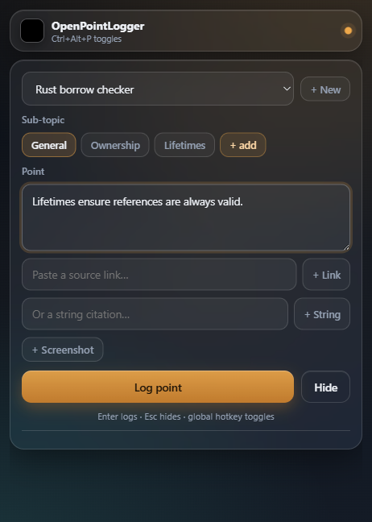
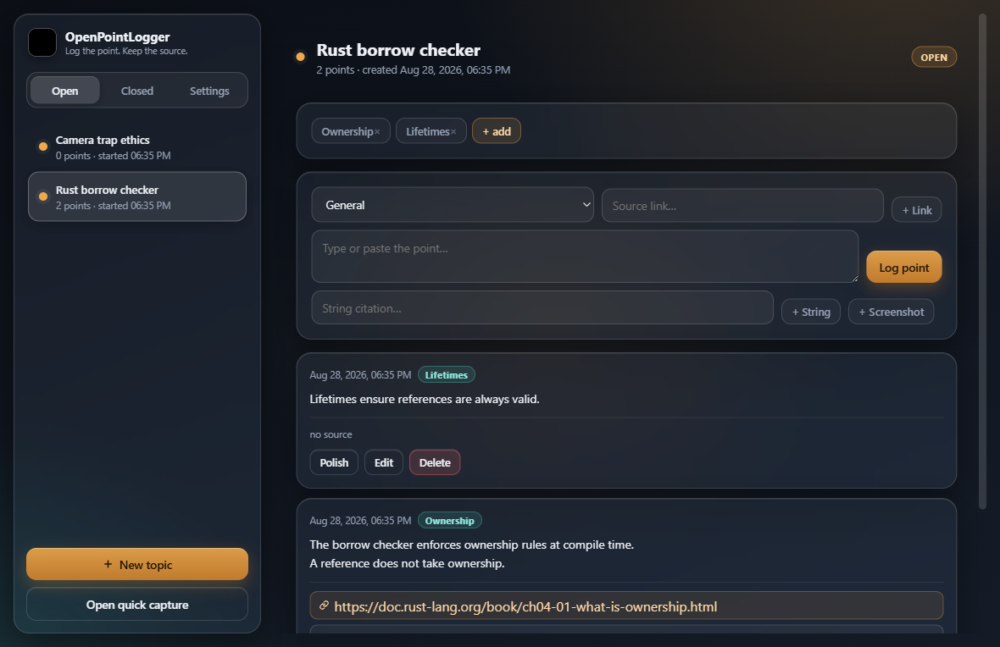

<div align="center">

# Trailmark

**A glassmorphism research logger that stays out of your way. Press a global hotkey, drop a point with its source, keep researching — export a clean, cited report when the topic closes.**


</div>

Trailmark is the auditing sibling of [OpenTimeLogger](https://github.com/AAhmadS/OpenTimeLogger). Where OpenTimeLogger tracks *time*, Trailmark tracks *points*: the quick notes you take while researching a topic, each one attached to the source you found it in.

The whole point is speed. No new tab, no Google Doc, no shifting windows. You press `Ctrl+Alt+P`, a small always-on-top glass panel appears over whatever you are reading — a website, a PDF, another app — you type or paste the point, drop a source link, a string citation, or a screenshot, press **Enter**, and the panel stays put. Hit **Open app** to review everything in the full window. Close the topic when you are done and Trailmark hands you a clean, numbered, cited report (HTML + Markdown) of everything you logged.

No accounts. No cloud. No telemetry. Your research is your file.

---

## Screenshots

<div align="center">

| Quick capture (always-on-top) | Full window |
|:---:|:---:|
|  |  |

</div>

---

## Features

- **Global hotkey capture** — `Ctrl+Alt+P` (configurable in Settings) shows or hides a small, frameless, always-on-top glass panel. It never steals focus until you summon it, so it can sit over a website, PDF or any app while you keep working.
- **One Enter to log** — start a topic when you have none, then type or paste the point and press **Enter**. The point is saved with a timestamp and the panel stays open for the next one.
- **Open app from the popup** — hit **Open app** in the popup header to jump straight to the full window. Your logs are always one click away after capture.
- **Sub-topics** — tag points under sub-topics with a click on a chip; filter and group them anywhere they appear.
- **Three citation kinds** — every point can carry a **link**, a **string citation** (book, paper, interview…), and/or a **screenshot**. Links open in your browser, string citations copy with a click, screenshots are stored locally and embedded in the report.
- **Close & export** — closing a topic locks it and exports a clean, numbered, cited report: a self-contained **HTML** file and a **Markdown** file. Sources are deduplicated into a **References** section and cited inline as `[1]`, `[2]`, …
- **Full window from the tray** — the app lives in the Windows tray (the navigation bar). Double-click the tray icon or use **Open Trailmark** to review, edit, and organize topics; the quick-capture popup stays independent. The main window always refreshes when shown, so popup logs appear immediately.
- **Single instance** — launching Trailmark while it's already running just brings the existing window forward — no duplicate processes or lost logs.
- **Optional bring-your-own-key AI assist** — no vendor lock-in and off by default. Works with **OpenRouter**, **OpenAI**, **Mistral AI** and **AvalAI**. Polish a point's wording or draft a topic summary on export. Default profile: **OpenRouter + `deepseek/deepseek-v4-flash`**. You bring the key; nothing is sent anywhere unless you click Polish or Export.
- **Private by design** — your data lives in `%APPDATA%\Trailmark` (`points.json`, `config.json`, `attachments/`, `exports/`). Nothing leaves your machine unless you turn on AI assist. Data from the older install location is migrated automatically on first launch.

## Getting started

### Option A — run the prebuilt app

Grab `Trailmark.exe` from the [Releases](../../releases) page and double-click it. No Python required.

> Requires the WebView2 runtime, which ships with Windows 10 and Windows 11.

### Option B — run from source

Requires Python 3.11+ on Windows.

```bash
git clone https://github.com/AAhmadS/OpenPointLogger.git
cd OpenPointLogger
pip install -r requirements.txt
pythonw point_logger.py     # or: python point_logger.py
```

The app starts in the tray and the full window. Press `Ctrl+Alt+P` to summon the quick capture panel. Use **Open app** in the popup to jump to the full window.

### Building the standalone `.exe`

```bash
build.bat
```

Or manually:

```bash
pip install pyinstaller
pyinstaller --noconfirm --clean --onefile --windowed \
  --name Trailmark --icon app.ico \
  --add-data "assets;assets" \
  --hidden-import webview.platforms.winforms \
  --hidden-import pystray._win32 \
  point_logger.py
```

The binary lands in `dist/Trailmark.exe`.

### Windows install (from the built `.exe`)

The install helper places the app in `%LOCALAPPDATA%\Programs\Trailmark`, creates a **Desktop** and **Start Menu** shortcut, adds a **Startup** shortcut (so the tray icon and hotkey are available every login), and copies a **`Pin to Taskbar.cmd`** helper next to the app:

```powershell
$installDir = "$env:LOCALAPPDATA\Programs\Trailmark"
New-Item -ItemType Directory -Force $installDir | Out-Null
Copy-Item "dist\Trailmark.exe" "$installDir\Trailmark.exe"
Copy-Item "app.ico" "$installDir\app.ico"
Copy-Item "Pin to Taskbar.cmd" "$installDir\Pin to Taskbar.cmd"

$ws = New-Object -ComObject WScript.Shell
foreach ($folder in @("$env:USERPROFILE\Desktop",
                      "$env:APPDATA\Microsoft\Windows\Start Menu\Programs",
                      "$env:APPDATA\Microsoft\Windows\Start Menu\Programs\Startup")) {
  $lnk = $ws.CreateShortcut("$folder\Trailmark.lnk")
  $lnk.TargetPath = "$installDir\Trailmark.exe"
  $lnk.WorkingDirectory = $installDir
  $lnk.IconLocation = "$installDir\app.ico,0"
  $lnk.Save()
}
```

Your data lives separately in `%APPDATA%\Trailmark` and survives reinstalls.

On most Windows builds the `Pin to Taskbar.cmd` helper pins the app to the taskbar automatically (it copies the shortcut into the taskbar pin store and refreshes Explorer). On builds where Windows ignores that store, drag the Desktop shortcut onto the taskbar — the tray icon is always available either way.

## The workflow

1. **Research.** You're reading something and hit a point worth keeping. Press `Ctrl+Alt+P`.
2. **First time for this topic?** Type the topic name and press Enter. The panel switches to log mode.
3. **Log.** Type or paste the point. Optionally paste a link (Enter), a string citation, or attach a screenshot. Press **Enter**.
4. **Keep going.** The panel stays on top. Log another point, tag a sub-topic chip, then hide the panel with the hotkey or hit **Open app** to review.
5. **Done.** Open the full window (tray → *Open Trailmark* or **Open app** from the popup), select the topic, and hit **Close & export**. You get `report.html` and `report.md` with every point grouped by sub-topic, numbered inline citations, embedded screenshots, and a References section.

## Hotkeys & shortcuts

| Shortcut | Action |
| --- | --- |
| `Ctrl+Alt+P` | Toggle the quick capture panel (anywhere on Windows) |
| `Enter` | Log the point / add a link / add a citation |
| `Shift+Enter` | Newline inside the point field |
| `Esc` | Hide the quick capture panel |
| `Open app` (popup) | Show the full window |
| `Click` on a link source | Open it in your browser |
| `Click` on a string source | Copy the citation |
| `Click` on a screenshot | Open the image |

Change the global hotkey in **Settings → Global hotkey** (modifiers + a key). If another app already owns the combination, Trailmark tells you and keeps the old one.

## AI assist (optional, bring-your-own-key)

Everything is off by default. In **Settings → AI assist**:

1. Tick **Enable AI assist**.
2. Pick a provider — **OpenRouter** (default, with `deepseek/deepseek-v4-flash`), **OpenAI**, **Mistral AI**, or **AvalAI** — and paste your API key. Base URL and model are editable; leave Base URL empty for the provider default.
3. Hit **Test connection**, then **Save settings**.

With it enabled you get two helpers:

- **Polish** on a point — rewords the note into clean, precise prose while keeping every factual claim and your sources untouched.
- **Draft AI summary** on a closed topic — writes a short, faithful summary of the logged points.

Both are one-click, review-the-result workflows: a draft never edits your data on its own. The API key is stored in `config.json` next to the app data and is never sent anywhere except to the provider you selected.

## How it stores data

| File / folder | Purpose |
| --- | --- |
| `%APPDATA%\Trailmark\points.json` | Every topic, point, sub-topic and source. |
| `%APPDATA%\Trailmark\config.json` | Your hotkey and AI-assist settings. |
| `%APPDATA%\Trailmark\attachments/` | Screenshots you attach to points. |
| `%APPDATA%\Trailmark\exports/` | `report.html` + `report.md` produced when a topic is closed. |
| `assets/` | Brand icon, logo, and the app's small icon variants. |

> Migrated automatically from the old `%LOCALAPPDATA%\Programs\OpenPointLogger` location on first launch of Trailmark.

## Project layout

```
Trailmark/
├── point_logger.py     entry point — windows, tray, hotkey, API bridge, single-instance guard
├── point_store.py      data layer + cited-report export (HTML & Markdown), %APPDATA% store + legacy migration
├── ui.py               glass UI — quick capture panel + full window (Open app + live refresh)
├── hotkey.py           global hotkey (RegisterHotKey, no admin needed)
├── single.py           single-instance guard (Windows named event)
├── llm.py              optional BYOK client (OpenRouter/OpenAI/Mistral/AvalAI)
├── brand.py            brand assets as data URIs
├── assets/             icon & logo
├── tests/              headless unit tests (store, hotkey, llm)
└── build.bat           PyInstaller one-file build
```

## Running the tests

```bash
python -m pip install -r requirements.txt
$env:PYTHONPATH="."; python tests\test_store.py
$env:PYTHONPATH="."; python tests\test_hotkey.py
$env:PYTHONPATH="."; python tests\test_llm.py
```

## License

MIT — see [LICENSE](LICENSE).
